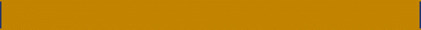
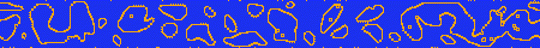
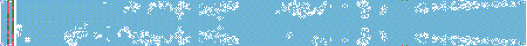
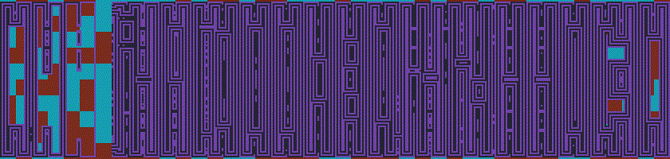

# Ultimate Lattice Model Monster Mashup

This app started off as an attempt to visualise different lattice models, and to see what happens when you mix a bunch of them together. It is currently very visually-oriented, though I intend to add some analytics later.

## Getting started
Before you have a chance at running it, you have to build the c-libraries with cython. If you have cython installed, everything you need to build the libraries should be in the setupCfuncs.py files, and particularly the 'cyscript.sh' file will show you what is needed. maybe you can just run that script.

Unless you have QT5 on your computer, it is pretty hard to get it working at the moment. I do inted to package it with QT at some point but not yet. This means that the pip install doesnt work either. All you can do is clone the git repo and try running one of the executables (**Xcute is the main GUI, Xterminal is a terminal version**).

To facilitate rapid testing, there are a few keybeard shortcuts:
> NB: much has changed in version 2, maybe I'll add back some of these later but for now they are gone.
* **E** starts a dynamic run. The length is determined by the 'frames' in the bottom right.
* **Esc** interrupts the current run, or closes the app if nothing is running. (Closing is pretty buggy.)
* ~~**1** turns the stochastic noise engine on and off~~
* ~~**2** turns the Life engine on and off~~
* ~~**Z** steps forward one frame~~
* ~~**B** paints the background with a cellular automaton~~
* **WASD** controlls the 'coverage' aka how much noise is added when you clear the scren and 'beta', which determines how noise the simulation is while running.
* **XC** controls the maximum FPS it will operate at. The two FPS values given at the top are the current performance of the two main engines, and the actual FPS is always limited to the lowest of these three values.
* **Alt** brings the focus out of a textbox, so you can use the keyboard shortcuts again after editing something.

A note on the update rules: currently rules of the following sort are permitted,
> a <= NB <= b

where a and b are the maximum and minimum number of neighbours (NB) that a cell can have and survive. So if a=1 and b=8 a cell will always survive. Standard Conway rules say cells survive with 2 or 3 neighbors.

> c <= P <= d

where c and d are the number of cells that, when surrounding an empty cell, will give birth (P -- 'parents') to a new cell. In Conway P=3.

So the standard Conway rule is '2,3,3,3;'.

Liberal parentage (c = 1,2) results in explosive growth. Unbounded parentage (d=6,7,8) results in violently oscillating populations when coupled with normal death rules.

Rules can also be chained, so for example 2,2,3,5;2,3,2,3;2,4,3,5;2,3,4,5; is a rad little combo that will result in a different update rule every frame in a cycle of four frames. Mix it with a good serving of noise at the start.

Bars/fuzz: you can create scrolling bars that roll across the screen. The settings have to be floats (aka number.number). The settings are as follows:
* start: starting position, so you can offset mutliple bars
* width: width of bar in pixels
* step: step per frame, can be a fraction of a pixel I believe
* axis: 0 is horizontal, 1 is vertical
* bounce: if 1, the bar will bounce back when it hit an edge. if 0, it will jump back to the start
* [coverage: only available for the fuzzers, determines the amount of noise (1 is 'as many updates as there are pixels in the line')]
* polarity:
** bars: 1 is on/alive, 0 is off/dead, -1 is inactive (turns the bar off)
** fuzz: 1 is additive noise, 0 is normal noise, -1 is subtractive noise and -2 is inactive (fuzz off)

Turning the Ising model off (**1**) will result in deterministic runs, symmetrical if there was no noise at the start. 

The little area with the letters 'UB, LB, RB, WB, DB' is meant to be a sort of drawing of the screen-- the lines represent the edges. Anyway, here is where you control the boundary conditions. 1 means that boundary is fixed on, 0 fixed off and -1 means it is invisible (so the UB and DB wrap as do LB and RB, while WB ('wolfbound') just paints without interacting).

## About the models
The app is currently based on the following models:
- [x] **Ising Model** nice long-term behaviour when undisturbed by Conway, this model is rather overshadowed by the Life engine and tends only to act as a (very expensive) stochastic noise generator. Turn off conway (**2**) and turn up beta (**D**) and let it run for a while to see Ising at work.
- [x] **Conway's GoL** actually the engine is what they call 'Life-like' and can accept almost arbitrary rulesets. The rules are entered into the green box on the left. Some suggestions are below.

- [x] **Cellular Automata** Wolfram-style cellular automata can be painted on the screen (**B**), and a scroller is also available that will either wipe out all the cells or paint on full cells. Currently there is no meaningful interaction between the 2D automata and the other models, it is largely aesthetic. Lets see what becomes of it.

- [ ] Potts Model is actually in there, or it was, but has been depreceated. This is a nice version of Ising with more states, but currently the models only have 2 states so this is inactive. Might bring it back.

## Features in Current Version
- [x] Ising model
- [x] Life-like automata with time-varying rules
- [x] Dynamic update of settings without having to restart
- [ ] ~~'Wolfram' 2D automata painter~~ breifly depreciated
- [x] Arbitrary boundary conditions on top, sides and scroller
- [x] Colors!
- [ ] ~~Basic recording function (makes gifs, pretty buggy)~~ briefly depreciated

- [x] Roll function, can set the whole array to roll along x or y
- [x] Bars and fuzzers-- you can now set [scrolling] bars either of blocks (on of off) or of noise. The settings for the bars is described above.
- [x] Faster engines, better integrated with one another (rewritten in cython, still a little to go)

## Soonish features:
- [ ] Multiprocessing. Uses all the cores you have available.
- [ ] Analytic engine, so you can automatically characterise different update rules
- [ ] Easy interaction, can paint different initial conditions onto the canvas

## Features planned:
- ~~Good support for exporting videos/ gifs~~ will come later, just now I just want to get a sort of V2 out with updated and faster functions.
- Fancy shader graphics
- Automatic monsterfinder (looks for repeating patters with different update rules)
- More models! Including:
- [ ] **Prisoners Dilemma**
- [ ] **Eden Model**

