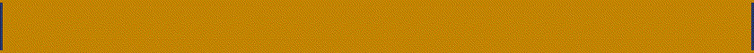
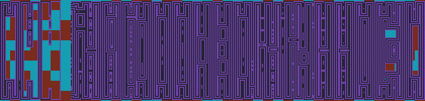

# Ultimate Lattice Model Monster Mashup

This app started off as an attempt to visualise different lattice models, and to see what happens when you mix a bunch of them together. It is currently very visually-oriented, though I intend to add some analytics later.

## Getting started
It is built using Python 3 and Qt5, so you will need both of those. Other dependencies (numpy, imageio etc.) are in the requirements.txt (NOTE TO SELF, NO THEY ARENT).

To facilitate rapid testing, there are a few keyboard shortcuts:
* **E** starts a dynamic run. The length is determined by the 'frames' in the bottom right.
* **Q** clears the screen and adds some noise, determined by the coverage.
* **1** turns the stochastic noise engine on and off
* **2** turns the Life engine on and off
* **Z** steps forward one frame
* **B** paints the background with a cellular automaton
* **WASD** controlls the 'coverage' aka how much noise is added when you clear the scren and 'beta', which determines how noise the simulation is while running.

## About the models
The app is currently based on the following models:
- [x] **Ising Model** nice long-term behaviour when undisturbed by Conway, this model is rather overshadowed by the Life engine and tends only to act as a (very expensive) stochastic noise generator. Turn off conway (**2**) and turn up beta (**D**) and let it run for a while to see Ising at work.
- [x] **Conway's GoL** actually the engine is what they call 'Life-like' and can accept almost arbitrary rulesets. The rules are entered into the green box on the left. Some suggestions are below.

- [x] **Cellular Automata** Wolfram-style cellular automata can be painted on the screen (**B**), and a scroller is also available that will either wipe out all the cells or paint on full cells. Currently there is no meaningful interaction between the 2D automata and the other models, it is largely aesthetic. Lets see what becomes of it.

- [ ] Potts Model is actually in there, or it was, but has been depreceated. This is a nice version of Ising with more states, but currently the models only have 2 states so this is inactive. Might bring it back.

## Features in Version 1
- Ising model
- Life-like automata with time-varying rules
- 'Wolfram' 2D automata painter
- Arbitrary boundary conditions on top, bottom and scroller
- Colors!
- Basic recording function (makes gifs, very buggy)

## Features coming in Version 2
- Fancy shader graphics
- Faster engines, better integrated with one another
- Analytic engine, so you can automatically characterise different update rules
- Easy interaction, can paint different initial conditions onto the canvas
- Good support for exporting videos/ gifs

## Features planned:
- The fanciest graphics
- Automatic monsterfinder (looks for repeating patters with different update rules)
- More models! Including:
- [ ] **Prisoners Dilemma**
- [ ] **Eden Model**

